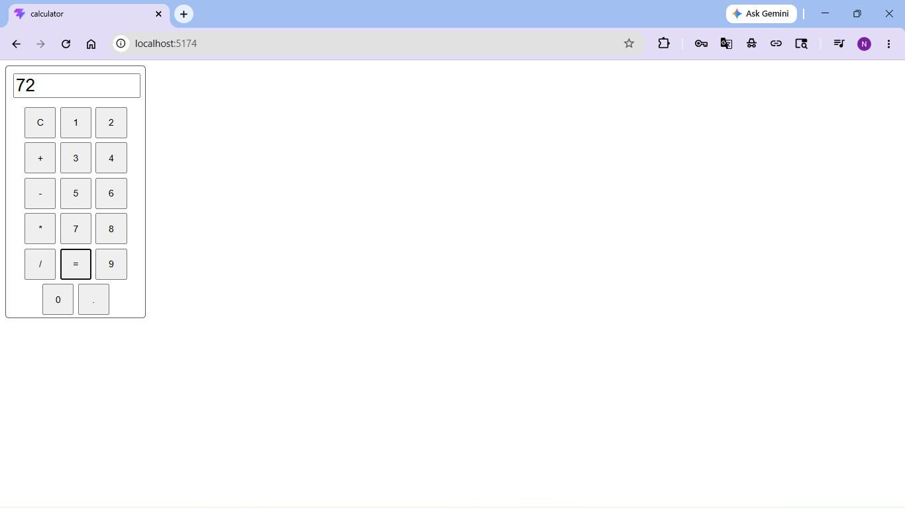

# React Calculator App

A simple calculator application built using React and Vite.

This project performs basic arithmetic operations through an interactive user interface.

---

## Live Demo

https://vikash-kherwa.github.io/react-calculator-app/

---


## Features

- Addition, subtraction, multiplication, and division
- Interactive button-based calculator UI
- Dynamic display updates using React state
- Responsive component-based structure
- Built using React and Vite

---

## Technologies Used

- React
- Vite
- JavaScript
- CSS Modules
- HTML5

---

## Project Structure

```text
calculator/
│
├── src/
│   ├── components/
│   ├── images/
│   │   ├── calculator-project-ss1.png
│   │   └── calculator-project-ss2.png
│   │
│   ├── App.jsx
│   ├── App.module.css
│   ├── index.css
│   └── main.jsx
│
├── package.json
├── index.html
└── README.md
```

---

## Screenshots

### Calculator UI


### Calculator Working




---

## Learning Outcome

Through this project, I practiced:

- React component architecture
- State management using useState
- Event handling in React
- CSS Modules styling
- Building interactive frontend applications
- Vite project setup

---


## Preview

This project is built for learning and practicing React fundamentals.
